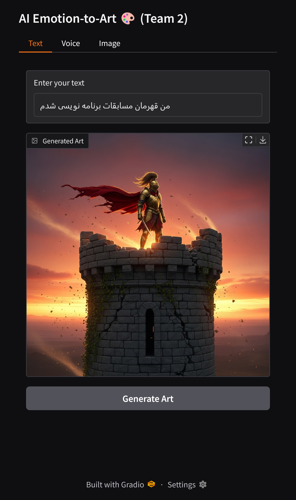

# AI Emotion-to-Art Team2

Transform Your Emotions into **AI-Generated Artworks**
تبدیل احساسات شما به **آثار هنری تولیدشده توسط هوش مصنوعی**

---

## Table of Contents | فهرست مطالب

* [Introduction | مقدمه](#introduction)
* [How It Works | نحوه عملکرد](#how-it-works)
* [Samples | نمونه‌ها](#samples)
* [Installation & Setup | نصب و راه‌اندازی](#installation--setup)
* [Debug / Troubleshooting | خطاها و اشکال‌زدایی](#debug--troubleshooting)
* [Team Members | اعضای تیم](#team-members)
* [Achievements | افتخارات](#achievements)
* [Contact | تماس](#contact)

---

## Introduction | مقدمه

**English:**
Team 2 is a **Gold Medal Winner** in the **AI Section** of the **Innoverse 2025 International Invention & Innovation Expo**, held on **August 24, 2025**. This expo focused on Metaverse and blockchain technologies and featured over 30 judging categories. Our project converts user emotions (text, voice, image) into symbolic visual artworks using advanced AI technologies:

* **Whisper** – Speech-to-text
* **Ollama (Gemma3:4b)** – Emotion recognition
* **Replicate (Imagen backend)** – Art generation

Visit the official expo site for more information: [Innoverse 2025](http://innoverse.world)

**فارسی:**
تیم ما موفق به کسب **مدال طلا در بخش هوش مصنوعی** در **نمایشگاه بین‌المللی Innoverse 2025** شد. این رویداد در تاریخ **۲۴ آگوست ۲۰۲۵** برگزار شد و تمرکز آن بر فناوری‌های متاورس و بلاک‌چین بوده و در بیش از ۳۰ بخش داوری انجام شد. پروژه ما با استفاده از فناوری‌های پیشرفته هوش مصنوعی، احساسات کاربر (متن، صدا، تصویر) را به آثار بصری نمادین تبدیل می‌کند:

* **Whisper** – تبدیل گفتار به متن
* **Ollama (Gemma3:4b)** – تشخیص احساسات
* **Replicate (Imagen backend)** – تولید اثر هنری

---

## How It Works | نحوه عملکرد

**English:**

1. Provide an emotion (text, voice, or image)
2. Recognize emotion via **Gemma3:4b** (Ollama)
3. Generate a symbolic prompt
4. Use **Replicate** to generate AI artwork

**فارسی:**

1. دریافت احساس (متن، صدا، تصویر)
2. تشخیص احساس با مدل **Gemma3:4b** (از طریق Ollama)
3. تولید یک پرامپت نمادین
4. ارسال به **Replicate** برای تولید اثر هنری

---

## Samples | نمونه‌ها

**Example | مثال:**

| Input                              | Generated Artwork                                   |
| ---------------------------------- | --------------------------------------------------- |
| من قهرمان مسابقات برنامه نویسی شدم |  |

---

## Installation & Setup | نصب و راه‌اندازی

### Requirements | پیش‌نیازها

* Python **3.13**
* Ollama with **Gemma3:4b** model installed
* Replicate API token
* **FFmpeg** (from `ffmpeg.rar`)

### Setup | راه‌اندازی

```bash
# Step 0: Extract FFmpeg
# Extract 'ffmpeg.rar' into a folder
# Add the 'bin' folder inside the extracted folder to your system PATH

# Install Ollama → https://ollama.com/
# Run: ollama run gemma3:4b

# Create virtual environment
python -m venv env
# Activate virtual environment
# Linux / macOS
source env/bin/activate
# Windows
.\env\Scripts\activate

# Install required Python packages
pip install openai-whisper replicate ollama gradio

# Set Replicate API token
# Linux / macOS
export REPLICATE_API_TOKEN="your_token_here"
# Windows
setx REPLICATE_API_TOKEN "your_token_here"

# Run Gradio application
python app.py
```

---

## Debug / Troubleshooting | خطاها و اشکال‌زدایی

```bash
# Ollama / Gemma3:4b Errors
“Model not found” → Gemma3:4b model not installed
Fix: ollama run gemma3:4b

“Cannot connect to Ollama” → Ollama service not active
Fix: Launch Ollama app or run ollama serve

# Replicate API Errors
HTTP 401 Unauthorized → Invalid or expired token
Fix: Generate new token at https://replicate.com/account

Model failed to load → Imagen may be temporarily unavailable
Fix: Wait and retry, or switch to another model

# FFmpeg Errors
"ffmpeg.exe not found" → FFmpeg not installed or not in PATH
Fix: Extract 'ffmpeg.rar' and add the 'bin' folder to your system PATH
```

---

## Team Members | اعضای تیم

* **Mohammad Mahdi Omidvar**
* **Mahyar Alizadeh**
* **Sogol Tarnabi**
* **Arad Chizari**

---

## Achievements | افتخارات

**English:**

* Gold Medal Winner in **AI Section**, Innoverse 2025 ([Official Results PDF](http://innoverse.world/innoverse%202025%20challenges%20result.pdf))
* Recognized internationally for an innovative AI project converting emotions into artworks

**فارسی:**

* مدال طلا در **بخش هوش مصنوعی**، Innoverse 2025 ([فایل نتایج رسمی](http://innoverse.world/innoverse%202025%20challenges%20result.pdf))
* شناخته‌شده در سطح بین‌المللی برای پروژه‌ای نوآورانه که احساسات را به آثار هنری تبدیل می‌کند

---

## Contact | تماس

[](https://instagram.com/PyQubit)
[](https://t.me/PyQubit)
[](mailto:PyQubit@gmail.com)

---

© 2025 **AI Emotion-to-Art Team2** — *Gold Medal Winner, AI Section, Innoverse 2025*

