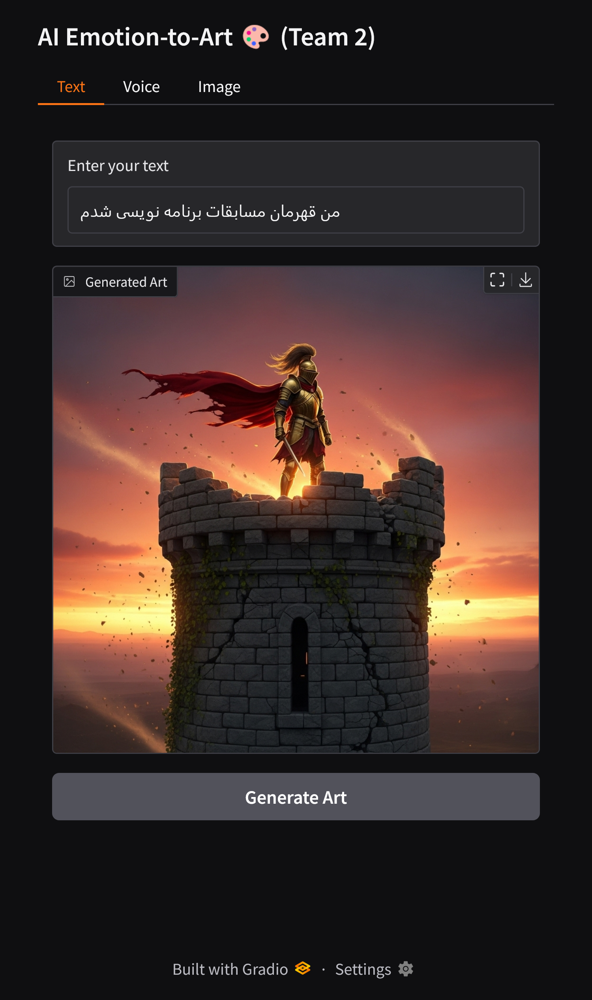

# 🎨 AI Emotion-to-Art — Team 2

> **Transform human emotions into AI-generated symbolic artworks.**
> **تبدیل احساسات انسانی به آثار هنری نمادین با استفاده از هوش مصنوعی.**

---

## 📌 Table of Contents | فهرست مطالب

* [👋 Introduction | مقدمه](#-introduction--مقدمه)
* [⚙️ How It Works | نحوه عملکرد](#️-how-it-works--نحوه-عملکرد)
* [🖼️ Samples | نمونه‌ها](#️-samples--نمونهها)
* [🛠️ Technologies | فناوری‌ها](#️-technologies--فناوریها)
* [📥 Installation & Setup | نصب و راه‌اندازی](#-installation--setup--نصب-و-راهاندازی)
* [🛠️ Troubleshooting | رفع خطا](#️-troubleshooting--رفع-خطا)
* [👥 Team | تیم](#-team--تیم)
* [🏆 Achievement | افتخار](#-achievement--افتخار)
* [📱 Contact | تماس](#-contact--تماس)
* [📄 License | مجوز](#-license--مجوز)

---

<a id="-introduction--مقدمه"></a>

## 👋 Introduction | مقدمه

### 🇬🇧 English

**AI Emotion-to-Art** is a multimodal AI project that transforms human emotions expressed through **text, voice, or images** into symbolic visual artworks.

The system combines speech recognition, emotion analysis, and generative AI to create an artwork representing the detected emotional state.

Team 2 received a **Gold Medal in the AI Section** at the **INNOVERSE 2025 International Invention & Innovation Expo**, held on **August 24, 2025** in Georgia, USA.

### 🇮🇷 فارسی

**AI Emotion-to-Art** یک پروژه هوش مصنوعی چندوجهی است که احساسات انسانی بیان‌شده از طریق **متن، صدا یا تصویر** را به آثار هنری بصری و نمادین تبدیل می‌کند.

این سیستم با ترکیب تشخیص گفتار، تحلیل احساسات و هوش مصنوعی مولد، اثری هنری متناسب با حالت احساسی شناسایی‌شده ایجاد می‌کند.

تیم ۲ موفق به کسب **مدال طلا در بخش هوش مصنوعی** در **نمایشگاه بین‌المللی اختراعات و نوآوری INNOVERSE 2025** شد که در **۲۴ آگوست ۲۰۲۵** در جورجیا، آمریکا برگزار شد.

---

<a id="️-how-it-works--نحوه-عملکرد"></a>

## ⚙️ How It Works | نحوه عملکرد

### 🇬🇧 English

The project follows a multimodal AI pipeline:

```text
User Input
   │
   ├── Text
   ├── Voice
   └── Image
        │
        ▼
Speech / Input Processing
        │
        ▼
Emotion Analysis
        │
        ▼
Emotion Representation
        │
        ▼
AI Image Generation
        │
        ▼
Symbolic Artwork
```

### 🇮🇷 فارسی

پروژه از یک خط پردازش چندوجهی برای تبدیل ورودی کاربر به اثر هنری استفاده می‌کند:

```text
ورودی کاربر
   │
   ├── متن
   ├── صدا
   └── تصویر
        │
        ▼
پردازش ورودی / گفتار
        │
        ▼
تحلیل احساسات
        │
        ▼
نمایش مفهومی احساس
        │
        ▼
تولید تصویر با هوش مصنوعی
        │
        ▼
اثر هنری نمادین
```

---

<a id="️-samples--نمونهها"></a>

## 🖼️ Samples | نمونه‌ها

### Example | مثال

**Input | ورودی:**

> من قهرمان مسابقات برنامه‌نویسی شدم

**Generated Artwork | اثر تولیدشده:**



---

<a id="️-technologies--فناوریها"></a>

## 🛠️ Technologies | فناوری‌ها

| Technology              | Role                | کاربرد                       |
| ----------------------- | ------------------- | ---------------------------- |
| 🐍 **Python**           | Core Development    | توسعه هسته پروژه             |
| 🎤 **Whisper**          | Speech-to-Text      | تبدیل گفتار به متن           |
| 🧠 **Ollama + Gemma 3** | Emotion Analysis    | تحلیل و شناسایی احساسات      |
| 🎨 **Replicate**        | AI Image Generation | تولید اثر هنری با هوش مصنوعی |
| 🖥️ **Gradio**          | User Interface      | رابط کاربری تعاملی           |
| 🎬 **FFmpeg**           | Audio Processing    | پردازش فایل‌های صوتی         |

---

<a id="-installation--setup--نصب-و-راهاندازی"></a>

## 📥 Installation & Setup | نصب و راه‌اندازی

### Requirements | پیش‌نیازها

* Python **3.13**
* [Ollama](https://ollama.com/)
* **Gemma 3 / gemma3:4b**
* Replicate API Token
* FFmpeg
* Internet connection for external AI services

### 1. Clone the Repository | دریافت پروژه

```bash
git clone https://github.com/PyQubit/Innoverse-2025.git
cd Innoverse-2025
```

### 2. Create a Virtual Environment | ساخت محیط مجازی

```bash
python -m venv env
```

**Windows:**

```bash
.\env\Scripts\activate
```

**Linux / macOS:**

```bash
source env/bin/activate
```

### 3. Install Dependencies | نصب وابستگی‌ها

```bash
pip install openai-whisper replicate ollama gradio
```

### 4. Configure Ollama | راه‌اندازی Ollama

Install Ollama and make sure the required model is available:

```bash
ollama run gemma3:4b
```

### 5. Configure Replicate | تنظیم Replicate

Set your API token as an environment variable.

**Windows:**

```bash
setx REPLICATE_API_TOKEN "your_token_here"
```

**Linux / macOS:**

```bash
export REPLICATE_API_TOKEN="your_token_here"
```

> ⚠️ Never commit API tokens, passwords, or other secrets to GitHub.
> ⚠️ هرگز API Token، رمز عبور یا اطلاعات محرمانه را در GitHub قرار ندهید.

### 6. Configure FFmpeg | تنظیم FFmpeg

Install FFmpeg and make sure its `bin` directory is available in your system `PATH`.

### 7. Run the Application | اجرای برنامه

Start the Gradio application and open the local URL displayed in the terminal.

---

<a id="️-troubleshooting--رفع-خطا"></a>

## 🛠️ Troubleshooting | رفع خطا

### Ollama / Gemma

**Error:** `Model not found`

```bash
ollama run gemma3:4b
```

**Error:** `Cannot connect to Ollama`

Make sure the Ollama service is running.

---

### Replicate

**Error:** `HTTP 401 Unauthorized`

Your API token may be invalid or expired. Generate a new token and update the environment variable.

**Error:** Model generation failure

The selected generation model may be temporarily unavailable. Retry the request or configure another supported model.

---

### FFmpeg

**Error:** `ffmpeg.exe not found`

Make sure FFmpeg is installed and its `bin` directory has been added to the system `PATH`.

---

<a id="-team--تیم"></a>

## 👥 Team | تیم

* **Mohammad Mahdi Omidvar**
* **Mahyar Alizadeh**
* **Sogol Tarnabi**
* **Arad Chizari**

---

<a id="-achievement--افتخار"></a>

## 🏆 Achievement | افتخار

### 🥇 Gold Medal — INNOVERSE 2025

### 🇬🇧 English

Team 2 was awarded a **Gold Medal in the AI Section** at the **INNOVERSE 2025 International Invention & Innovation Expo**.

The official award certificate recognizes:

> **Mohammad Mahdi Omidvar, Mahyar Alizadeh, Arad Chizari, Sogol Tarnabi**

for outstanding performance and innovative contributions in the **Artificial Intelligence & Programming Challenges**.

### 🇮🇷 فارسی

تیم ۲ موفق به دریافت **مدال طلا در بخش هوش مصنوعی** در **نمایشگاه بین‌المللی اختراعات و نوآوری INNOVERSE 2025** شد.

گواهی رسمی این جایزه، اعضای زیر را برای عملکرد برجسته و مشارکت‌های نوآورانه در **چالش‌های هوش مصنوعی و برنامه‌نویسی** معرفی می‌کند:

> **محمدمهدی امیدور، مهیار علیزاده، آراد چیزری و سگل ترنابی**

### 🥇 Gold Medal | مدال طلا

<p align="center">
  
</p>

<p align="center">
  <b>INNOVERSE 2025 — Gold Medal</b><br>
  <sub>مدال طلای INNOVERSE 2025</sub>
</p>

### 📜 Certificate of Award | گواهی دریافت جایزه

<p align="center">
  
</p>

<p align="center">
  <b>Certificate of Award — Gold Medal</b><br>
  <sub>گواهی دریافت مدال طلا</sub>
</p>

### 🔗 Official References | منابع رسمی

* **INNOVERSE Official Website:** http://innoverse.world
* **Official 2025 Results:** http://innoverse.world/innoverse%202025%20challenges%20result.pdf

---

<a id="-contact--تماس"></a>

## 📱 Contact | تماس

### Mohammad Mahdi Omidvar — PyQubit

* **GitHub:** https://github.com/PyQubit
* **Portfolio:** https://pyqubit.github.io/
* **Instagram:** https://instagram.com/PyQubit
* **Telegram:** https://t.me/PyQubit
* **Email:** [PyQubit@gmail.com](mailto:PyQubit@gmail.com)

---

<a id="-license--مجوز"></a>

## 📄 License | مجوز

This project is **proprietary software** and is protected by the accompanying proprietary license.

این پروژه یک **نرم‌افزار اختصاصی** است و تحت شرایط لایسنس اختصاصی پیوست‌شده محافظت می‌شود.

**© 2025–2026 Mohammad Mahdi Omidvar (PyQubit) — All Rights Reserved.**

See [`LICENSE`](LICENSE) for the complete terms.

---

<div align="center">

## 🥇 Gold Medalist — AI Section

### INNOVERSE 2025

**AI Emotion-to-Art — Team 2**

</div>

